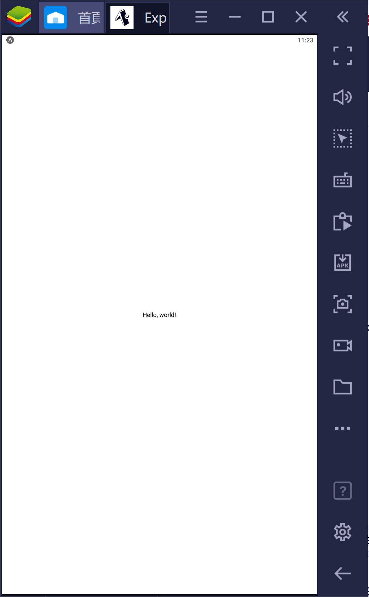
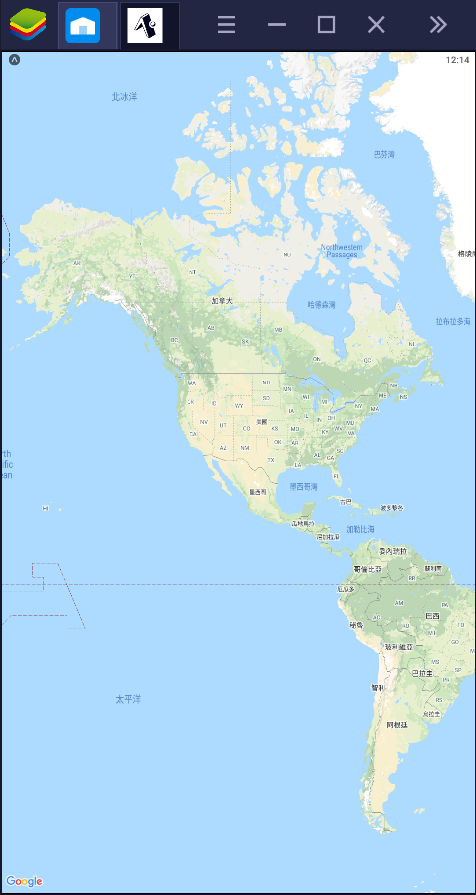
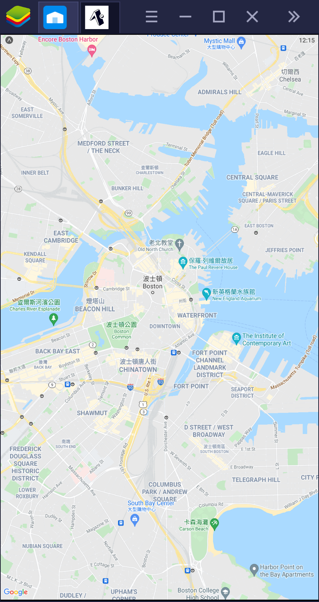
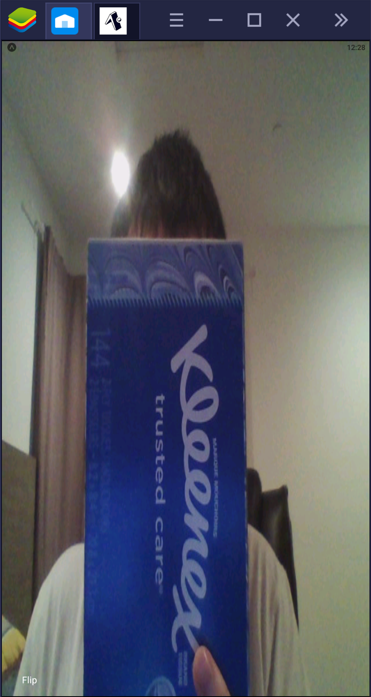
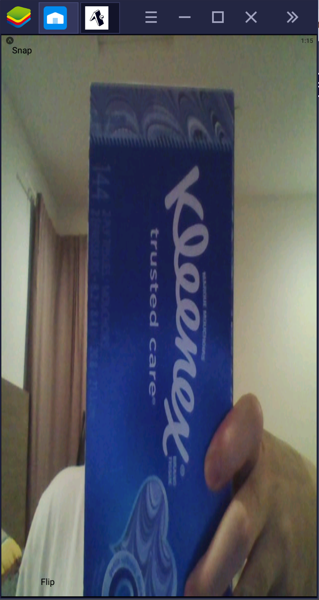
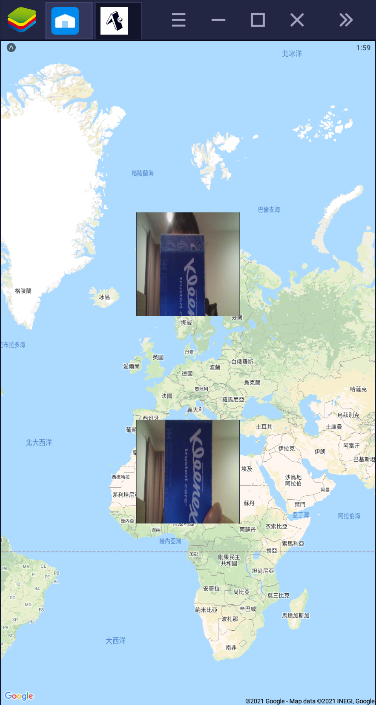
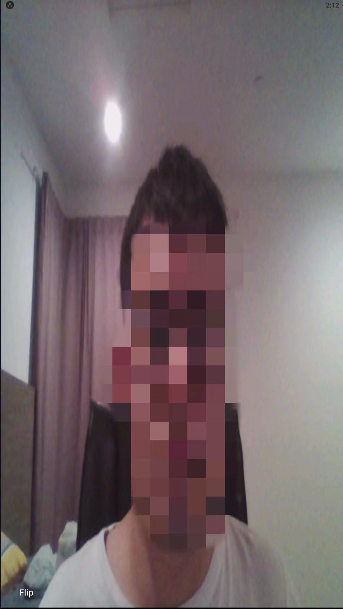
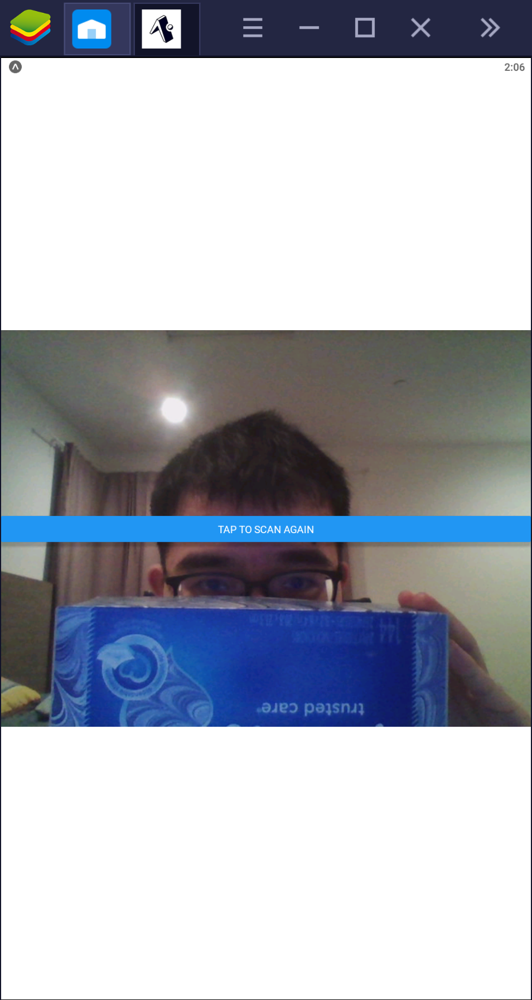
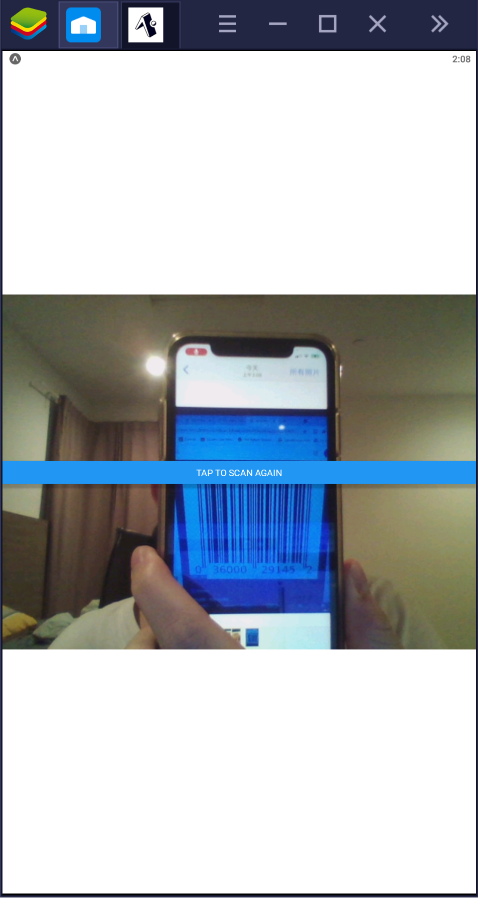
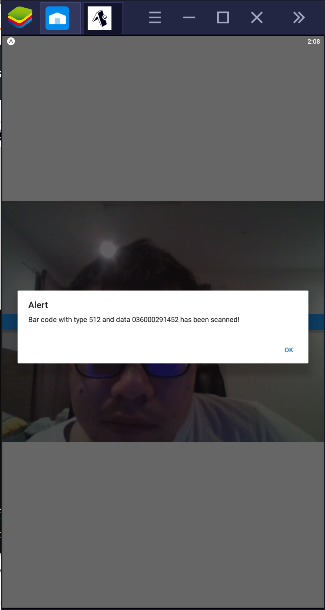

# camera-app-Zihang97

## Go through REACT native tutorial
As my phone is ios but I don't have a Mac, so I use android emulator on windows instead.
For Hello World program, what's shown on my emulator is below.

  

## Use case to display a map
As a mobile phone user, I want to see map on my phone to navigate the direction and path.

As a mobile phone user, I want to check the distance from my postion to target through the map displayed on the phone.

As a mobile phone user, I want to know the nearest restaurants and shopping mall for me to visit.

## Display a map

  
  

## Use case to take a picture
As a mobile phone user, I want to take the pictures of beautifule sceneries I'm viewing.

As a mobile phone user, I want to take a picture of other people like my friends.

As a mobile phone user, I want to take a picture of important infomation and notice to prevent forgetting.

## Camera
As I'm using a android emulator on my computer, only frond-camera can be used.

  

### Take a picture
Compared to above, I add a 'snap' button. When you click the 'snap' button, a picture will be taken and sent to terminal, then stored in the database.

  

### Image on map
Put the images taken by camera on the top of map

  

### Detect face and blur
Use cv2 in Opencv to detect face and a Gaussian blur to anonymize faces in images

  

### Scan barcode

  
  
  

